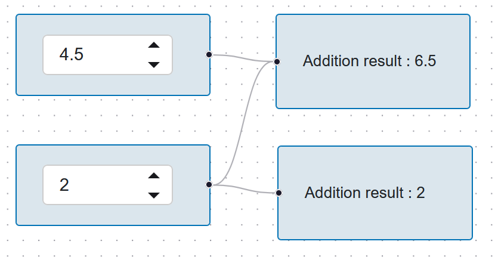

#   Reactflow

Reactflow is a node based editor that lets you build interactive node trees for various purposes such as workflows or objects customizations. It allows interactively adding/removing nodes, move nodes around and plug nodes to each others.

https://reactflow.dev/

The official website provides a range of use cases to illustrate the possibilities.

https://reactflow.dev/showcase

The source code of the xyflow, used in this module can be found at this GitHub address:

https://github.com/xyflow/xyflow/tree/main/packages/react

## panel-reactflow

**panel-reactflow** allows you to build a node graph filled with holoviz panel components and provide a python API to dynamically interact with the graph.


Two approaches are available in this module:

-   **ReactFlowGraph** : the node graph is seen from the outside, and can be interpreted by another code to have effects on the rest of the panel app;
-   **Workflow** : Nodes interact with each others through an update() cascade, transmitting data from one to another.

These two approaches serve different needs and can be selected based on the user goal.

##  Node graph

The `ReactFlowGraph` class can be found under `panel_reactflow.reactflow`, while the Workflow class is found under `panel_reactflow.workflow`. In both cases, a graph is defined by the following parameters:

-   `nodes_classes` (List[Type[ReactFlowNode]]): Definition of the node types that can be added to the graph.
-   `initial_nodes` (List[Node]): Nodes present in the graph when opening it.
-   `initial_edges` (List[Edge]): Edges present in the graph when opening it.
-   `display_side_bar` (bool): Display the side bar to drag and drop nodes in the graph.
-   `allow_edge_loops` (bool): Allow added edges to make loops (parameter present to prevent infinite update loops).

Once created, the `ReactFlowGraph` being a `ReactComponent` can then be added to a panel layout.

## Node definition

A node type as accepted by the ReactFlowGraph inherits from the `ReactFlowNode` class, its definition is found in `panel_reactflow.api`. A node type is defined by:

-   the `node_class_name` attributes provides the class name as appearing in the sidebar.
-   the `ports` attribute lists the ports of the node (dots on the node side that can be plugged to).
-   the `create` function that returns the holoviz panel component that will be displayed in the node.
-   the `name` attribute provides the node name, used to define links between nodes.

A `WorkflowNode` is an extension of the `ReactFlowNode` with the following attribute and functions:

-   the `plugged_nodes` is filled by the `Workflow` instance and provides the node the other nodes plugged to it using a dictionary, allowing the nodes to communicate.
-   the `update` function is triggered when a graph change suggests the node needs to be updated (node creation, edge creation/removal). In this function, the developer implements what happens to a node when its inputs are updated. At the end of the `update` function, the `update_outputs` can be called to trigger the node children update.
-   the `get_node_json_value` function returns in a json like object what defines the node to its children. For example, a node that embed a FloatInput widget would be built to return the content of this widget in the dictionnary.
-   `on_node_move`, `on_node_selected`, and `on_node_deselected` are functions triggered when the event happens to the node. This features is redundant with using the `on_event` function on the node graph. 

A set of WorkflowNodes is provided in `panel_reactflow.nodes` implementing the basic panel input widgets. They are all displayed in the example *all_base_nodes.py*:


## Port definition

Every node port is defined busing the ``NodePort`` class found in ``panel_reactflow.api``. The node port has the following properties:

-   ``direction`` (PortDirection) : Whether the port represents an input or an output
-   ``position`` (PortPosition) : Location of the port around the node : BOTTOM, TOP, LEFT or RIGHT
-   ``name`` (str) : Port name
-   ``display_name`` (bool) : Display the port name on the node (only available for LEFT and RIGHT ports).
-   ``offset`` (float) :  Port position offset to the top/left based on the position. If None, the port will be centered to the edge, even when several ports are present on that edge.
-   ``connection_count_limit`` (int) :  How many edges can be connected to the port. Defaults to None.
-   ``restriction`` (PortRestriction) :  Restriction of what can be plugged to the current port. Defaults to None, by default None

A ``PortRestriction`` is a class defined by a name and a color. When set, the ports and the edges will be displayed in this color.

## Edge definition

An edge makes a link between two node ports, creating a structure in the graph. An edge is defined by the names of the source and target node with their associated port names.

#   Use example

This section provides an example of how to build a workflow using the API. In this example, FloatInput based nodes can be plugged in output nodes, the output nodes will display the sum of the plugged float input nodes.

First the necessary classes must be imported from the module:

```python
from typing import Any, Dict, List

import panel as pn

from panel_reactflow.workflow import Workflow, WorkflowNode
from panel_reactflow.api import NodePort, PortDirection, PortPosition
```

The float input node is defined by the code below. 

-   A ``pn.widgets.FloatInput`` object is created and stored as class attribute. If its value change, the ``update`` function is called. 
-   In this case, the ``update`` function only needs to trigger its output nodes (nodes plugged to output ports).
-   The node has only one port, which is an output, which we decide to locate on the node right.
-   The ``create`` function returns a column that centers the ``FloatInput`` widget.
-   The node dictionary returned by ``get_node_json_value`` contains the ``FloatInput`` value that we set at the "value" key.

```python
class FloatInputNode(WorkflowNode):
    node_class_name = "Float Input"
    ports:List[NodePort] = [NodePort(direction=PortDirection.OUTPUT, position=PortPosition.RIGHT, name="output")]

    def __init__(self, ):
        super().__init__()
        self.float_input = pn.widgets.FloatInput(value=0., width=100)
        
        self.float_input.param.watch(self.update, "value")

    def create(self, ):
        return pn.layout.Column(
                                    self.float_input, 
                                    name=self.name, 
                                    align="center"
                                )
    
    def update(self, _):
        self.update_outputs()

    def get_node_json_value(self) -> Dict[str, Any]:
        return {"value" : self.float_input.value}
```


The result node input node is defined by the code below. 

-   The inputs sum is displayed in a  ``pn.pane.Markdown`` object that is created and stored as class attribute. 
-   The node has one input port, which we decide to locate on the node left to be consistent with the float input node.
-   The ``create`` function returns a column that centers the ``Markdown`` widget.
-   In this case, the ``update`` function reads the list of nodes plugged at its ``input`` port:
    -   if no node is plugged, a "Result : Undefined" message is displayed
    -   if nodes are plugged, their value is summed and displayed in the ``Markdown`` widget.

```python
class ResultNode(WorkflowNode):
    node_class_name = "Result"
    ports:List[NodePort] = [NodePort(direction=PortDirection.INPUT, position=PortPosition.LEFT, name="input")]

    def __init__(self, ):
        super().__init__()
        self.result_label = pn.pane.Markdown("Result : Undefined")

    def create(self, ):
        return pn.layout.Column(
                                    self.result_label, 
                                    name=self.name, 
                                    align="center"
                                )
    
    def update(self, _):
        value = 0

        if "input" in self.plugged_nodes :
            if len(self.plugged_nodes["input"]) == 0:
                self.result_label.object = f"Result : Undefined"
            else:
                for float_input in self.plugged_nodes["input"]:
                    value += float_input.get_node_json_value()["value"]

                self.result_label.object = f"Addition result : {round(value, 1)}"
            self.update_outputs()

    def get_node_json_value(self) -> Dict[str, Any]:
        return {}
```

Once the nodes are defined, they can be provided to the ``Workflow`` class in the node_classes parameter. That way, the graph will be instantiated empty, and nodes can be added from the sidebar.

```python
def make_reactflow():
    rf1 = Workflow(nodes_classes = [FloatInputNode, ResultNode],
                    initial_nodes=[],
                    initial_edges=[])

    return rf1

make_reactflow().show()
```

Once built, this example can provide the following graph:



#  Customizing the Reactflow JavaScript

panel-reactflow implements a set of features such as maximum connection counts, connection restriction or the sidebar drag and drop. More features are presented in the Reactflow website with the associated source code: 

https://reactflow.dev/examples

panel-reactflow source code can be edited by users to implement these features as explained in the website examples.